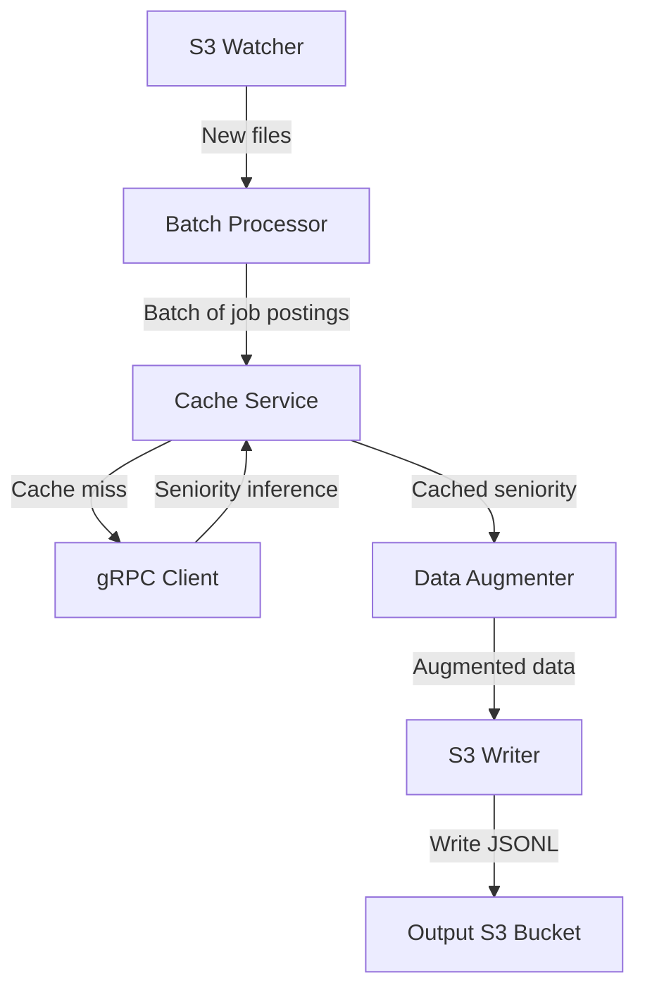

# data-augmentation-service

The system architecture is designed with the following components, each chosen for specific reasons:

1. **S3 Watcher**: Uses AWS S3 event notifications to efficiently detect new files without constant polling.
Rationale: This approach minimizes latency in file detection and reduces unnecessary API calls to S3.
2. **Batch Processor**: Implements a custom solution for reading and processing files in batches.
Rationale: Batch processing allows for optimized throughput and efficient use of resources, especially when dealing with the high volume of data (8M new lines per day).
3. **Cache Service**: Utilizes Redis as a distributed cache.
Rationale for choosing Redis:
    - High performance: Redis is an in-memory data store, providing extremely fast read and write operations.
    - Data structures: Redis supports complex data structures, allowing for efficient storage and retrieval of seniority data.
    - Scalability: Redis Cluster enables horizontal scaling to handle growing data volumes.
    - Persistence: Redis offers options for data persistence, ensuring cache durability.
    - TTL support: Built-in time-to-live functionality allows for easy management of cache freshness.
    - Atomic operations: Redis supports atomic operations, crucial for maintaining data consistency in a distributed environment.
4. **gRPC Client**: Custom implementation to communicate with the seniority model endpoint.
Rationale: A custom client allows for fine-tuned control over request batching, retries, and error handling specific to the seniority model's requirements.
5. **Data Augmenter**: Custom component for adding seniority information to job postings.
Rationale: This separation of concerns allows for easy updates to the augmentation logic without affecting other components.
6. **S3 Writer**: Utilizes AWS SDK for efficient writing to S3.
